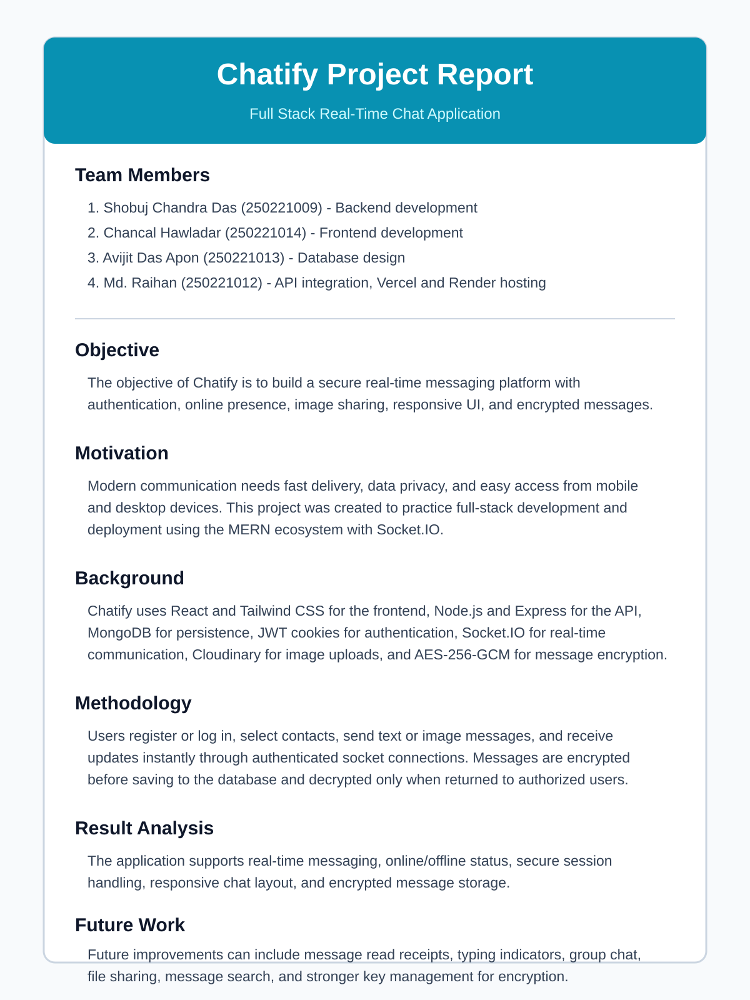
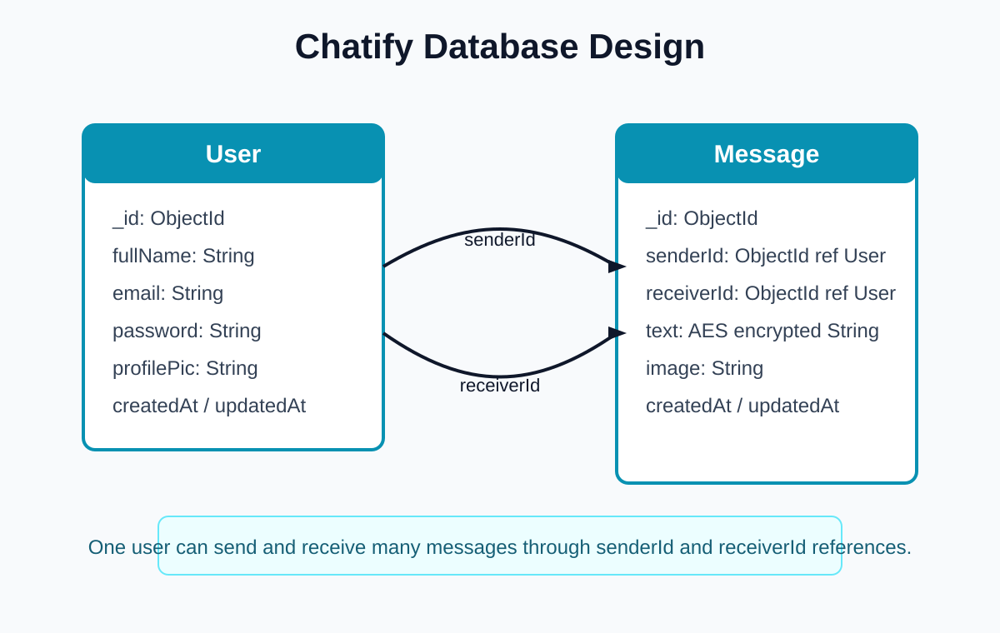

# Chatify Project Report

## Team Members

- Shobuj Chandra Das (250221009): Backend development
- Chancal Hawladar (250221014): Frontend development
- Avijit Das Apon (250221013): Database design
- Md. Raihan (250221012): API integration, Vercel and Render hosting

## Objective

Chatify is a full-stack real-time chat application. The main objective is to provide secure user authentication, instant messaging, online presence, image sharing, responsive UI, and encrypted message storage.

## Motivation

Real-time communication applications need speed, privacy, and device-friendly design. This project was built to practice frontend, backend, database, API integration, deployment, and real-time socket communication in one complete system.

## Background

The project uses React, Vite, Tailwind CSS, DaisyUI, Zustand, Node.js, Express, MongoDB, JWT authentication, Socket.IO, Cloudinary, and AES-256-GCM message encryption.

## Methodology

Users create an account or log in with JWT-based authentication. Authenticated users can select contacts and send text or image messages. Text messages are encrypted before being saved to MongoDB and decrypted only when returned to authorized users. Socket.IO sends new messages and online status updates in real time.

## Result Analysis

The application supports real-time messaging, online/offline indicators, secure authentication, image upload, responsive chat UI, and encrypted message persistence.

## Future Work

Future improvements can include typing indicators, read receipts, group chat, message search, file sharing, and stronger key management.

## Database Design

