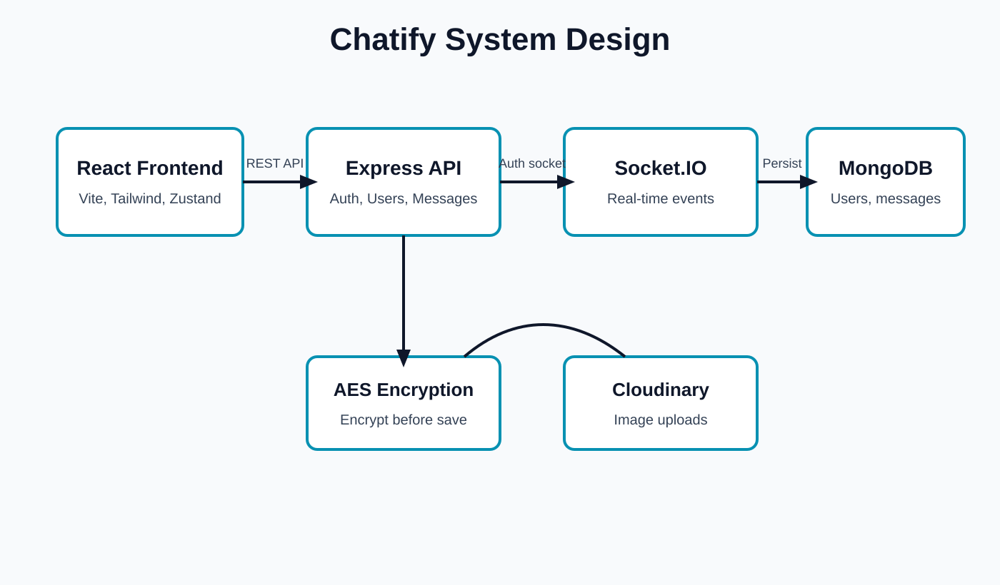

# Chatify System Design

## Architecture

Chatify uses a React frontend and an Express backend. The frontend communicates with the backend through REST APIs for authentication, contacts, chats, and message history. Real-time messaging and online status are handled through authenticated Socket.IO connections.

## Main Components

- Frontend: React, Vite, Tailwind CSS, DaisyUI, Zustand
- Backend: Node.js, Express, JWT authentication, Socket.IO
- Database: MongoDB with User and Message collections
- Media Storage: Cloudinary for image messages
- Security: HTTP-only JWT cookies and AES-256-GCM encrypted message text
- Deployment: Frontend on Vercel and backend on Render

## Message Flow

1. User logs in and receives an HTTP-only JWT cookie.
2. Frontend connects to the backend socket server with credentials.
3. User sends a message through the REST API.
4. Backend encrypts text with AES-256-GCM and stores it in MongoDB.
5. Backend decrypts the saved message for authorized API/socket responses.
6. Receiver gets the message instantly through Socket.IO.

## Database Design

